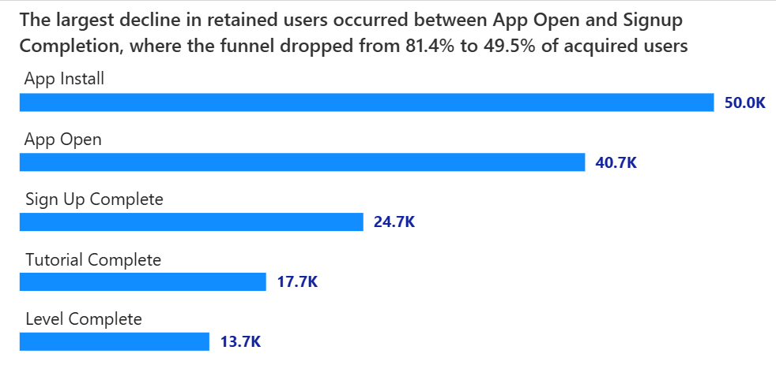
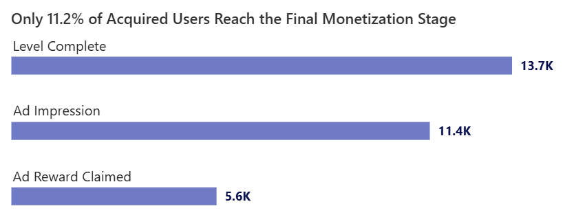

# Mobile Game Funnel & Monetization Analysis

### A product analytics case study examining user acquisition, activation, engagement, and monetization performance across 50,000 users acquired during Q1 2024.

---

# Executive Summary

During **Q1 2024**, the game acquired **50,000 new users**, providing an opportunity to evaluate how effectively players progressed from acquisition through activation, engagement, and monetization. This analysis was conducted to identify performance bottlenecks across the user journey and highlight opportunities to improve player retention and revenue generation.

User acquisition remained strong throughout the quarter; however, funnel performance revealed significant losses during onboarding. While **81.4% of installers opened the application**, only **49.5% completed signup**, making the onboarding process the largest source of user attrition. By the end of the activation journey, only **27.3% of acquired users reached level completion**, indicating substantial engagement leakage before users experienced the game's core value.

Monetization analysis showed further opportunities for improvement. Of the users who completed a level, **22.8% were exposed to a rewarded advertisement**, while only **11.2% of all acquired users ultimately claimed a reward**. These findings suggest that both ad exposure and reward-claim participation can be optimized to increase monetization efficiency.

Acquisition channel analysis identified **Organic** as the highest-performing source, contributing approximately **40% of all level completions** during the quarter. Device-level analysis further indicated stronger progression among **Android users (57.4%)** compared to **iOS users (42.6%)**.

The analysis indicates that the greatest opportunity for growth lies in reducing friction between **App Open and Signup Completion**, improving onboarding engagement, and increasing participation in rewarded-ad experiences. Addressing these areas has the potential to improve both player retention and monetization outcomes across the funnel.

# Project Overview

As part of the Q1 2024 product performance review, the analytics team was tasked with evaluating how effectively newly acquired users progressed through the mobile game's lifecycle—from installation and onboarding to engagement and monetization. Understanding user behavior across this journey is critical for identifying retention bottlenecks, improving player experience, and maximizing revenue opportunities.

The analysis was conducted using a user-level event dataset containing activity from 50,000 users acquired during January–March 2024. The dataset captures key behavioral events across the player journey, including app installation, app opening, signup completion, tutorial completion, level completion, advertisement exposure, and reward claiming. Additional user attributes such as acquisition channel, device type, country, session activity, and demographic information were also available to support segmentation analysis.

# Goals

1. Measure user progression across the activation funnel, quantify conversion rates between key stages, and identify the primary points of user drop-off within the onboarding journey.

2. Evaluate the effectiveness of the rewarded-ad monetization funnel by tracking user progression from Level Completion to Ad Reward Claimed.

3. Assess the proportion of acquired users that successfully reach key engagement and monetization milestones.

4. Compare funnel performance across acquisition channels to identify the highest-quality sources of users.

5. Analyze behavioral differences between Android and iOS users to understand device-level performance variations.

6. Generate data-driven recommendations to improve user retention, engagement, and monetization efficiency.

# Insights Deep Dive

## 1. User Acquisition & Top-Level Funnel Performance

During Q1 2024, the game acquired **50,000 new users**, providing a strong foundation for growth. However, progression through the user journey revealed substantial losses before users reached key engagement and monetization milestones.

Of all acquired users, **81.4% opened the application**, indicating strong initial interest after installation. However, only **49.5% completed the signup process**, **35.5% completed the tutorial**, and just **27.3% progressed to level completion**. By the final monetization stage, only **11.2% of acquired users successfully claimed a rewarded ad**, highlighting significant user leakage throughout the funnel.

These findings suggest that while acquisition efforts are generating a healthy volume of installs, the business is currently capturing only a small fraction of the potential value represented by newly acquired users.

## 2. Activation Funnel Analysis

The activation funnel revealed a steady decline in user retention as players progressed through the onboarding journey. Of the **50,000 users acquired during Q1 2024**, **81.4% opened the application**, indicating strong initial interest following installation. However, retention decreased substantially at subsequent stages, with only **49.5% of acquired users completing signup**, **35.5% completing the tutorial**, and **27.3% ultimately reaching level completion**.

These figures indicate that nearly half of all acquired users disengaged before completing the signup process, while almost three-quarters failed to reach a level completion milestone. As users progress deeper into the onboarding journey, each stage introduces additional friction that gradually reduces the active player base.

The largest decline in retained users occurred between App Open and Signup Completion, where the funnel dropped from **81.4% to 49.5% of acquired users**. This represents a loss of nearly one-third of the original user base before players fully entered the game experience. Such a significant reduction suggests that the signup process may be creating unnecessary barriers that discourage users from continuing their journey.

By the end of the activation funnel, only **13,701 of the original 50,000 acquired users** remained active enough to complete a level. This indicates that the business is currently realizing engagement value from only a fraction of newly acquired players, highlighting onboarding optimization as a critical opportunity for improvement.

## 3. Monetization Funnel Analysis

The monetization funnel examined how effectively acquired users progressed from gameplay engagement to rewarded-ad participation. While **27.3% of acquired users reached level completion**, retention continued to decline as users moved toward monetization events.

Only **22.8% of acquired users were exposed to a rewarded advertisement**, indicating that a portion of engaged players never encountered a monetization opportunity. Retention decreased further at the final stage, where only **11.2% of all acquired users successfully claimed a reward after viewing an advertisement**.

Viewed from an acquisition perspective, this means that nearly **89% of acquired users failed to reach the final monetization stage**. Although user acquisition efforts successfully generated 50,000 installs during the quarter, only **5,618 users ultimately progressed through the complete monetization journey**.

The gap between level completion (**27.3%**) and reward claim (**11.2%**) suggests that significant monetization potential remains unrealized. Increasing ad exposure among engaged users and improving reward-claim participation could help convert a larger share of active players into monetized users without requiring additional acquisition spend.

Overall, the monetization funnel demonstrates that revenue opportunities are constrained not only by user retention challenges during onboarding but also by declining participation in rewarded-ad experiences. Addressing both activation and monetization leakage will be essential for maximizing the lifetime value of acquired users.

## 4. Acquisition Channel Performance

Acquisition channel analysis revealed meaningful differences in both engagement quality and monetization outcomes across traffic sources.

While **Organic acquisition contributed approximately 40.4% of all level completions**, indicating strong engagement quality, **App Store Search users demonstrated the highest monetization efficiency**. Approximately **15.4% of App Store Search users reached the rewarded-ad claim stage**, outperforming Organic users (**13.7%**), Influencer users (**9.8%**), and Paid Social users (**6.4%**).

Session behavior further reinforced these findings. App Store Search users recorded the highest average session duration at approximately **14.35 minutes per session**, suggesting stronger intent and deeper engagement compared to other acquisition sources. In contrast, Paid Social users exhibited both the lowest monetization rate and the shortest average session duration, indicating lower-quality traffic relative to other channels.

These results suggest that while Organic acquisition remains the largest contributor to engaged users, App Store Search generates the most valuable users from a monetization perspective. Future acquisition strategies should evaluate channel performance not only by volume but also by downstream engagement and revenue contribution.

## 5. Device Performance Analysis

Device-level analysis revealed contrasting patterns between engagement volume and monetization efficiency.

Android users accounted for **57.4% of level completions**, making them the largest contributor to overall engagement. However, when examining monetization outcomes, **iOS users significantly outperformed Android users**. Approximately **15.0% of iOS users progressed to the rewarded-ad claim stage**, compared to only **9.2% of Android users**.

Session behavior showed a similar trend. iOS users recorded an average session duration of approximately **4.23 minutes**, higher than Android users at **3.4 minutes**.

These findings suggest that Android is currently the stronger platform for scale and engagement volume, while iOS users exhibit higher monetization potential. As a result, product and monetization initiatives may benefit from platform-specific optimization strategies, particularly those aimed at increasing monetization conversion among Android users while continuing to capitalize on the stronger revenue potential observed within the iOS user base.

## 6. Key Business Implications

The analysis suggests that the primary challenge is not user acquisition but user retention and monetization. Although the game acquired **50,000 users during Q1 2024**, only **27.3% reached level completion** and **11.2% progressed to the rewarded-ad claim stage**, limiting the value generated from acquisition efforts.

The onboarding journey emerged as the largest opportunity for improvement, with user retention declining from **81.4% at App Open** to **49.5% at Signup Completion**. Addressing friction during onboarding could significantly improve downstream engagement and monetization outcomes.

Channel and device analyses revealed that user quality varies across segments. While **Organic acquisition generated the largest share of engaged users**, **App Store Search users demonstrated the strongest monetization performance and longest session durations**. Similarly, **Android users drove higher engagement volume**, whereas **iOS users exhibited stronger monetization behavior**.

Overall, the findings indicate that improving onboarding conversion, increasing rewarded-ad participation, and prioritizing high-quality user segments are likely to generate the greatest impact on retention, engagement, and revenue growth.

